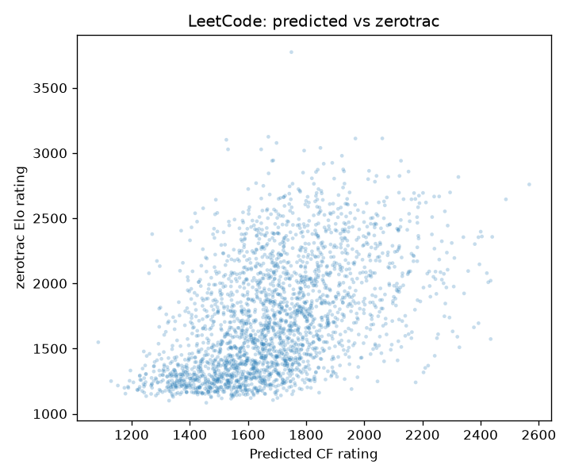
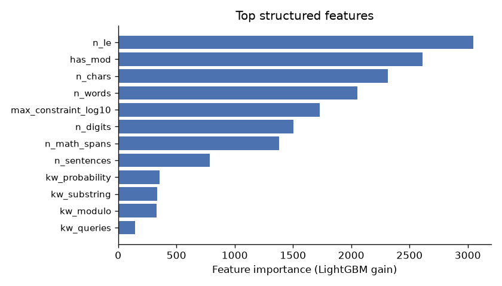
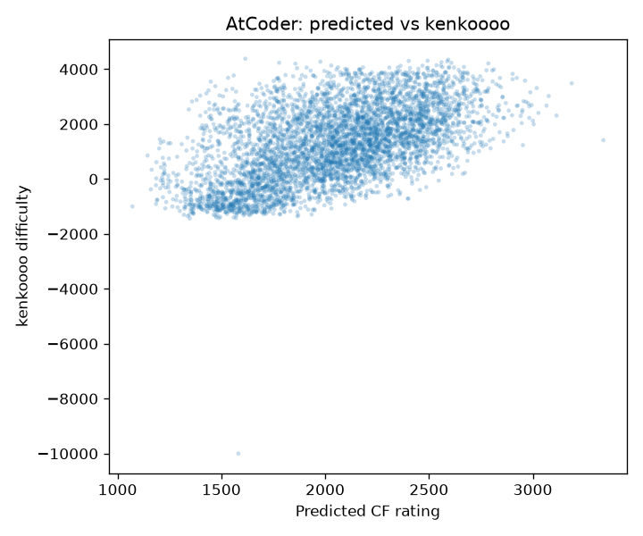

# Cross-Platform Competitive-Programming Difficulty Predictor

Predicting how hard a programming problem is **from its statement alone** - and showing
that difficulty learned on one judge transfers to others.

A model trained only on **Codeforces** problem text predicts difficulty on **LeetCode**
and **AtCoder** (which have no comparable rating scale) and agrees with their *independent*
performance-based ratings at **Spearman ρ ≈ 0.52–0.55** across **7,000+ unseen problems** -
two methods that share no data and work on opposite principles (reading the problem vs.
watching submissions) converging on the same difficulty ordering.



## Why predict a rating Codeforces already shows?

Because the model never uses it where the label exists. It is:

- **Content-based** - it reads the *problem*, so it works on brand-new, unrated, or
  contest-less problems where no performance data exists yet.
- **Transferable** - most judges (LeetCode, AtCoder, CodeChef, interview sets) have *no*
  unified difficulty number. Train on Codeforces' labels, apply everywhere.

So the Codeforces rating is the training signal, never the prediction target in practice.

## Results

Held-out test set = the **newest contests** (split by contest, never randomly so
near-duplicate problems from one round can't leak across the split).

| Model | MAE | RMSE | within ±100 |
|---|---|---|---|
| Baseline - predict global mean | 688 | 810 | 8.7% |
| Baseline - constraint magnitude only | 677 | 794 | 9.0% |
| Structured features (LightGBM) | 530 | 673 | 12.4% |
| **Structured + TF-IDF (LightGBM)** | **480** | **641** | **17.3%** |

Each tier improves monotonically over the baselines. The single most important feature is
the parsed **constraint magnitude** - the order of magnitude of the input bound (`n ≤ 10⁵`
vs `10¹⁸`), which encodes the intended complexity class.



### The headline: cross-platform transfer

The model is applied, with **no retraining**, to two judges and scored against fully
independent rating systems:

| Target judge | Independent rating source | n | Spearman ρ |
|---|---|---|---|
| LeetCode | zerotrac (Elo + MLE from contests) | 2,455 | **+0.52** |
| AtCoder | kenkoooo difficulty estimates | 4,698 | **+0.55** |



## Features (statement-only, no Codeforces tags)

Codeforces tags are **deliberately excluded** from the model: they leak difficulty *and*
don't exist on other platforms, which would break transfer. Everything is derived from the
statement so it generalises:

- **Constraint-magnitude parsing** - extracts the largest input bound from LaTeX (`10^5`,
  `2 \cdot 10^5`, `10^{18}`), unicode (`≤`), and plain forms, excluding modulo primes like
  `10⁹+7`. Coverage: **99.6%** of real statements.
- Statement length (words, characters, sentences), math/LaTeX density, comparison-operator
  counts, modulo presence, and a curated bag of algorithm-suggestive keywords.
- Metadata: time limit, memory limit, solved-count (log-scaled).
- TF-IDF (1–2 grams) over the statement, fit on the training split only.

## Method

`Codeforces API + scrape → features → contest-level split → baselines + LightGBM → transfer`

1. **Collect** ~10.8K rated Codeforces problems (statements + metadata) via the API and
   cached page scraping.
2. **Engineer** the statement features above (no tags).
3. **Split by contest** (newest contests held out) to prevent leakage.
4. **Train** baselines, a structured-only model (interpretable), and a structured+TF-IDF model.
5. **Transfer** to LeetCode/AtCoder and correlate predictions with independent ratings.

## Limitations (honest)

- **The absolute error is modest (MAE ≈ 480 rating points).** Much of a problem's difficulty
  lives in the *insight* it requires, which the words don't reveal. So a purely text-based
  model captures the part that *is* in the statement (constraints, structure, vocabulary) and
  no more. ρ ≈ 0.5 is roughly the honest ceiling for this signal; a bigger number would more
  likely indicate leakage than skill.
- **Not novel.** clist.by, zerotrac, and research on rating prediction cover nearby ground.
  The contribution here is a clean, leakage-controlled, content-based build with an
  independently-validated cross-platform transfer result, not a new idea.
- **Next step** to push MAE down: replace TF-IDF with a fine-tuned code/text encoder
  (CodeBERT/DeBERTa) over the statements.

## Reproduce

```bash
pip install -r requirements.txt
# sanity-check the pipeline on synthetic data (no network needed):
python make_synthetic.py && python train.py data_synthetic.csv
# real run:
python collect.py                 # builds data/cf_problems.csv (caches scraped pages)
python train.py data/cf_problems.csv
python crossplatform.py           # transfer + correlations + scatter plots
```

## Data sources & credits

- Codeforces API and problem statements (© Codeforces; scraped politely, cached).
- LeetCode ratings: [zerotrac/leetcode_problem_rating](https://github.com/zerotrac/leetcode_problem_rating) (MIT).
- AtCoder difficulties: [kenkoooo AtCoder Problems](https://kenkoooo.com/atcoder/).

## License

MIT - see `LICENSE`.
